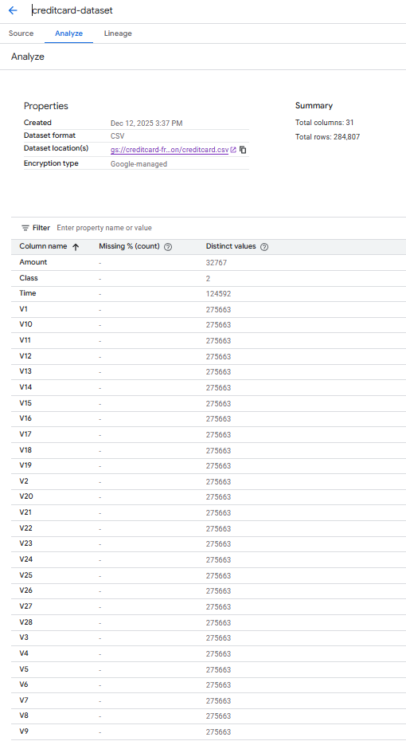
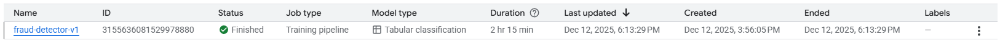
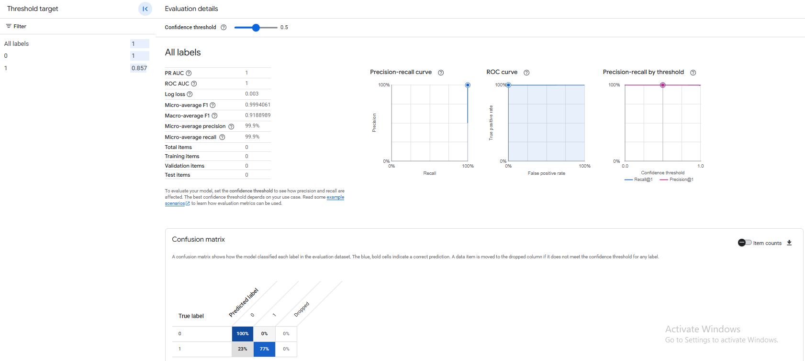
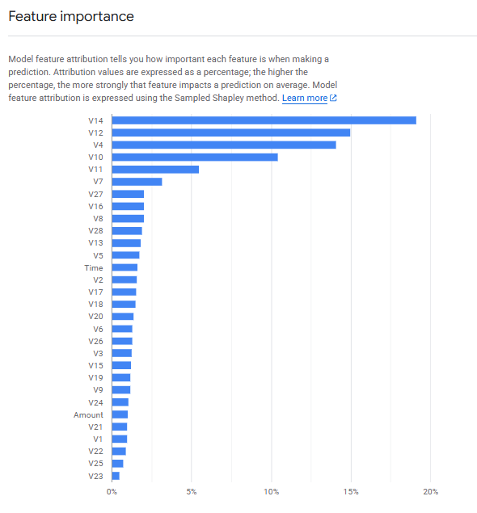
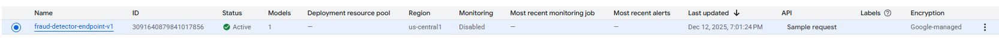
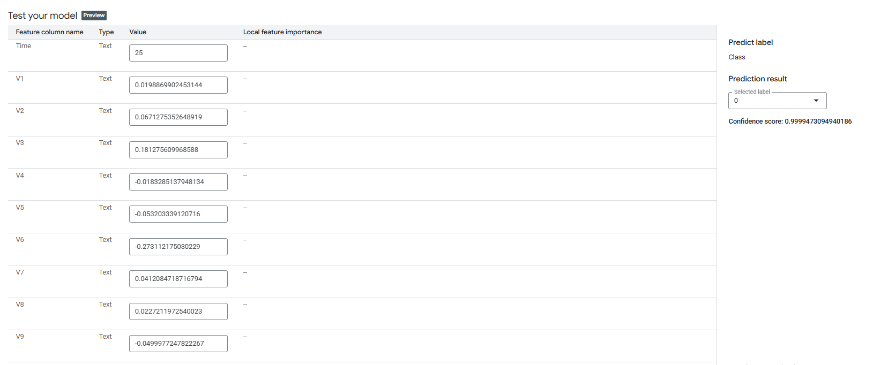

# Credit Card Fraud Detection with Vertex AI AutoML

Production-style fraud detection model using Google Cloud Vertex AI AutoML on the classic imbalanced credit card transactions dataset.

## Business Problem

Detect fraudulent credit card transactions in near real time so the bank can block or challenge suspicious payments before financial loss occurs.

## Data

- Source: Public **Credit Card Fraud Detection** dataset (`creditcard.csv`). [web:133][web:145]  
- Size: **284,807** transactions and **31** columns. [web:133][web:145]  
- Features:
  - `Time`: Seconds elapsed between each transaction and the first transaction in the dataset.
  - `V1`–`V28`: PCA‑transformed numerical features (original features are anonymized). [web:133][web:148]  
  - `Amount`: Transaction amount.
- Target:
  - `Class`: Fraud label, where `0` = legitimate transaction and `1` = fraudulent transaction (highly imbalanced, ~0.17% fraud). [web:133][web:145] 

## Approach

- Platform: Google Cloud Vertex AI AutoML Tabular. [web:1][web:137]  
- Task: Binary classification (`Class` as target).  
- Objective: Maximize AUC / precision‑recall due to heavy class imbalance. [web:117][web:138]  
- Steps:
  1. Upload `creditcard.csv` and create tabular dataset.
  2. Configure AutoML training with `Class` as target.
  3. Train with a 1 node‑hour budget.
  4. Evaluate on the test split (AUC, precision, recall for fraud).
  5. Deploy best model to a Vertex AI endpoint and test sample transactions. [web:116][web:137]  

## Results

_Values will be filled from the Vertex AI **Evaluate** tab using the held‑out test split._ [web:48][web:137]

| Metric                   | Value | Notes                               |
|--------------------------|-------|-------------------------------------|
| AUC ROC                  | [ ]   | Overall ranking quality.           |
| AUC PR (fraud = 1)       | [ ]   | Better for this imbalanced dataset.|
| Precision (fraud = 1)    | [ ]   | Of predicted frauds, how many real.|
| Recall (fraud = 1)       | [ ]   | Of real frauds, how many caught.   |

## Visual Evidence

## Deployment

- Deployed to a Vertex AI endpoint for online fraud scoring.
- Example usage: send transaction features and receive fraud probability in response. [web:5][web:137]  

## Learnings

- Handling highly imbalanced data with AutoML (AUC PR, threshold tuning). [web:117][web:138]  
- Using Vertex AI AutoML for fast, production‑style fraud models without custom code. [web:1][web:137]

---
**Built by Luv Saxena - AI Generalist Portfolio Project**  
*December 2025*
